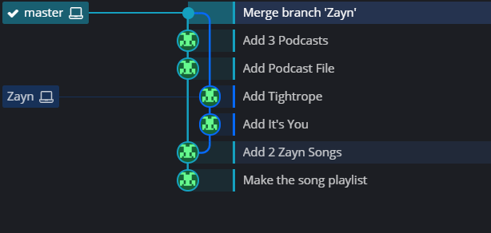

# MERGING

## What is Merging?

- Merging is used to incorporate changes together from different branches.
- For e.g. Lets say there 2 branches: A and B. Branch A has feature 1 and branch B has feature 2 and we want both the features together. Hence, by merging, we will get the result feature 1 + feature 2.
- `git merge` is the command that is used
- Important points ->

  1. We merge branches and not specific commits
  2. We always merge to the current HEAD branch

- If we have to merge the master and a feature branch, then we must:

  a. Switch to master (or the branch we want to merge into)
  b. Use the git merge command to merge the changes into the current branch.

- If a branch has 3 commits and some other branch has 2 commits, then after merge the branch will have 5 commits.

# Merge Commits

- Not all merges are fast-forward merges.
- This kind of merge happens when there is a some kind of untracked progress on the branch we are trying to merge into.
- E.g. 2 branches: master and bugfix. We want to merge the bugfix branch with master branch but post making of the bugfix branch, there is some kind of work that has been done on the master branch. This kind of merge is not fast forward.

- If there is no conflict, then a new commit is done, also known as the **`merge commit`**
- Git might or might not perform a prompt that allows you to write a message (regarding message)
- Visualization - 
